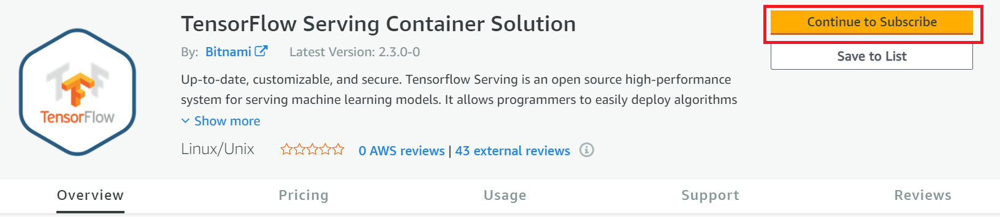
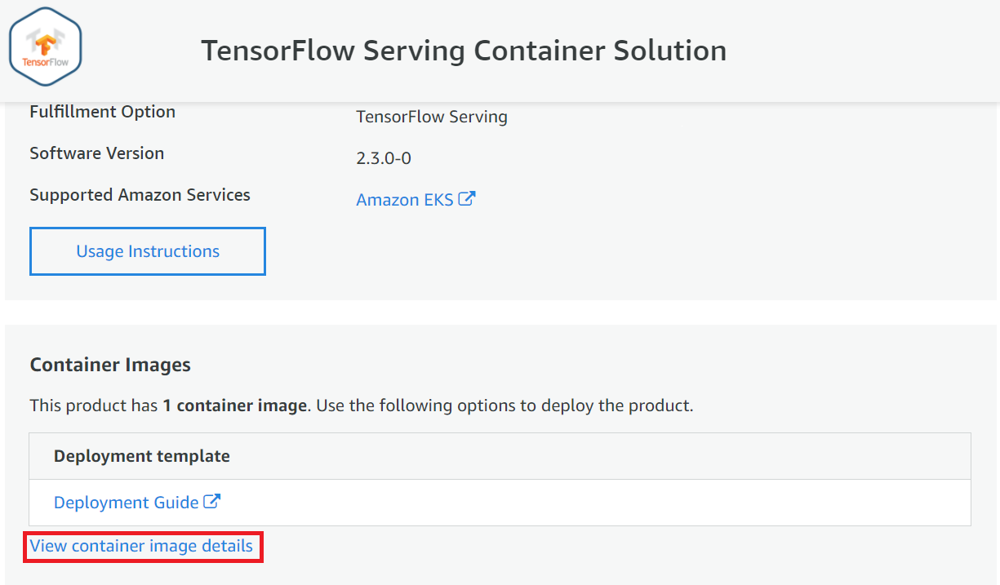

## Launching ECR containers using the tool

Containers on AWS are hosted on AWS ECR registry, to launch such containers, subscribe to the container from your account on aws marketplace and get the container link, with this link, the tool can be used as is.

## Subscribe to the container on AWS marketplace

Go to AWS marketplace, subscribe to the contianer you want to host on ECR

## Get container URL

Once subscribed, on the new page, click on  `View container image details` to get the link

On the details page, you can get the container image link, use it deploy a service using the oneContainer-Cloud-Tool.

